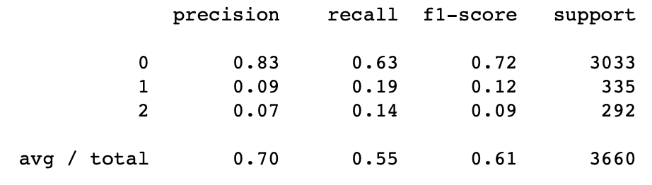

# Twitter_US_Airline_Sentiment_Analysis
Performed a 3-way Sentiment Analysis on the dataset
Given Twitter US Airline Sentiment Dataset, which contains data for over 14000 tweets, in this i am predicting the sentiment of the tweet i.e. positive, negative or neutral.

# Results

MultinomialNB : Training accuracy = 70%
